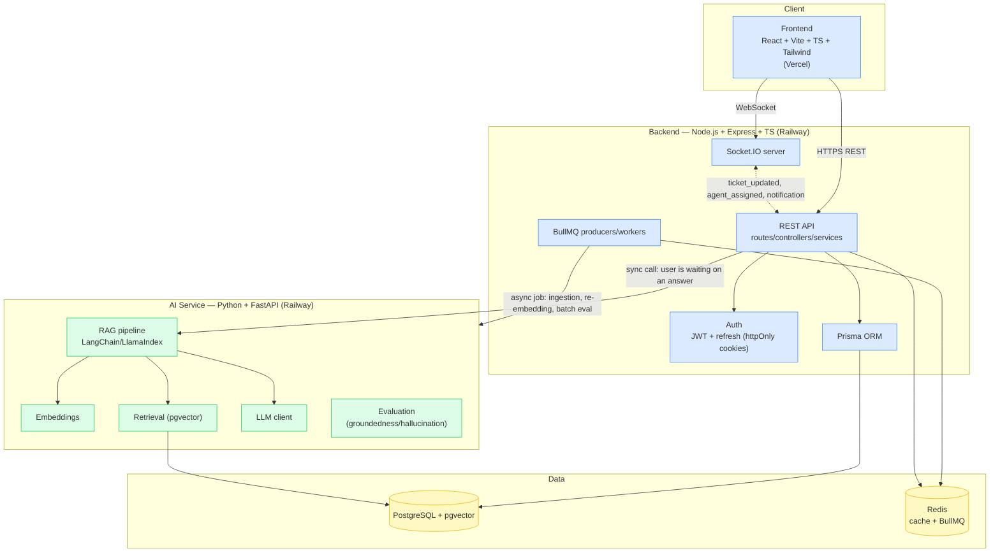

# Architecture - AI-Powered Customer Support Platform

This document records the current service boundaries and the implementation
state verified in the repository and Docker Compose environment.

## System diagram

## Ownership boundary (Operating Rule 3)

- **Node owns application state**: users, tickets, conversations, auth,
  role-based access control. Every write to these entities goes through
  Node/Prisma — the AI service never writes to these tables directly.
- **Python owns AI processing only**: embeddings, retrieval, LLM calls,
  RAG orchestration, groundedness/hallucination evaluation. It can *read*
  the knowledge-base/pgvector tables it needs for retrieval, but it does
  not own conversation or ticket state.
- Node calls the AI service over HTTP (sync, request/response) for
  in-the-moment chat replies, and enqueues BullMQ jobs (async) for work
  the user isn't blocked on (ingestion, re-embedding, batch evaluation
  runs). See `docs/ai.md` for the reasoning behind each choice as it's
  made, phase by phase.

## Deploy targets

- Frontend → Vercel
- Backend, AI service, Postgres, Redis → Railway

## Status

The backend currently exposes `/api/health`, the authentication routes
`/api/auth/register`, `/login`, `/refresh`, `/logout`, and `/logout-all`, plus
the authenticated profile route `/api/users/me` and customer-scoped
conversation and customer-message routes under `/api/conversations`.
Customer messages call Python's `/api/chat` synchronously; Node remains the
only writer of conversation and message application state.
Authentication is Docker-verified: access JWTs are signed, refresh tokens are
stored as SHA-256 hashes in PostgreSQL, refresh rotates the token, and logout
revokes it. Each refresh JWT includes a random `jti` so tokens issued for the
same user in the same second remain distinct; `jti` is not the Prisma row ID.

The backend runs on port 4000, the AI service on 8000, and the frontend on
5173 in Docker Compose. Knowledge document creation enqueues asynchronous
ingestion after persisting a pending document; the AI service performs bounded
paragraph-aware chunking. Provider-backed embeddings and pgvector writes are
implemented with `text-embedding-3-small` and validated at 1536 dimensions;
query retrieval uses pgvector similarity with a degraded fallback. Socket.IO authenticates access JWTs during connection,
places clients in private user rooms, and provides server-side emitters for
`ticket_updated`, `agent_assigned`, and `notification`. Resource-specific room
authorization is enforced against conversation ownership and ticket customer or
active assignment before room joins; the frontend exposes a reusable client and
event hook. BullMQ workers, ticket tooling, admin workflows, and analytics
remain planned work.
