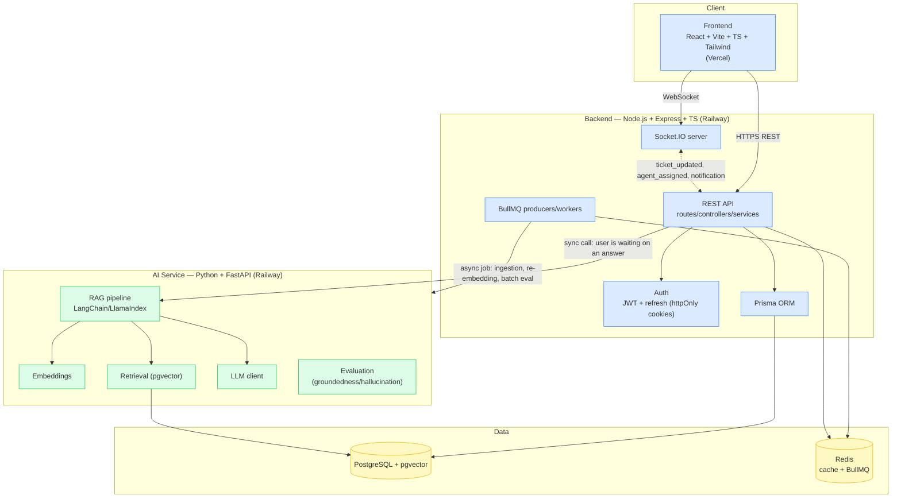

# Architecture — AI-Powered Customer Support Platform

> Note: I don't have access to the project's architecture/QA doc in this
> session (it wasn't attached to the conversation or project workspace), so
> the diagram and boundaries below are reconstructed from the stack and
> operating rules given directly in the Phase 1 brief. If the source spec
> has additional detail (e.g. specific queue topology, additional services),
> reconcile this doc against it before Phase 2 and I'll update it.

## System diagram

## Ownership boundary (Operating Rule 3)

- **Node owns application state**: users, tickets, conversations, auth,
  role-based access control. Every write to these entities goes through
  Node/Prisma — the AI service never writes to these tables directly.
- **Python owns AI processing only**: embeddings, retrieval, LLM calls,
  RAG orchestration, groundedness/hallucination evaluation. It can *read*
  the knowledge-base/pgvector tables it needs for retrieval, but it does
  not own conversation or ticket state.
- Node calls the AI service over HTTP (sync, request/response) for
  in-the-moment chat replies, and enqueues BullMQ jobs (async) for work
  the user isn't blocked on (ingestion, re-embedding, batch evaluation
  runs). See `docs/ai.md` for the reasoning behind each choice as it's
  made, phase by phase.

## Deploy targets

- Frontend → Vercel
- Backend, AI service, Postgres, Redis → Railway

## Status

Phase 1 (this doc): structure only, no request path is implemented yet
beyond `/api/health` on both Node and Python services. This diagram will
be revisited as each phase lands real endpoints/queues so it stays accurate
rather than aspirational.
